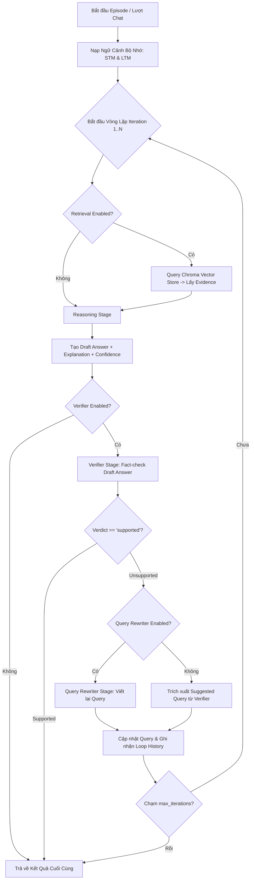

# MED-AI — Framework Đánh Giá & Chat Y Khoa Đa Tầng (V0 - V3)

MED-AI là một framework thử nghiệm và đánh giá các hệ thống trí tuệ nhân tạo y khoa theo kiến trúc **Modular Pipeline & Multi-Agent**. Hệ thống được thiết kế để đo lường, so sánh hiệu năng qua từng giai đoạn tiến hoá (từ V0 đến V3), hỗ trợ cả chế độ đánh giá tự động (Benchmark trên bộ dữ liệu **MedQA-USMLE**) và chế độ trò chuyện tương tác (Interactive Chat REPL).

---

## 📌 1. Tiến Trình Tiến Hoá (V0 ➔ V3)

Framework được thiết kế với 4 phiên bản kiến trúc chính:

- **V0 — Direct LLM Reasoning**:
  - Mô hình suy luận trực tiếp (Direct Zero-shot / Few-shot Reasoning).
  - Không truy xuất tài liệu bên ngoài, không kiểm chứng, không bộ nhớ.
- **V1 — RAG Evidence Retrieval**:
  - Tích hợp kỹ thuật **Retrieval-Augmented Generation (RAG)**.
  - Truy xuất các đoạn văn bản/sách giáo khoa y khoa từ **ChromaDB vector store** làm minh chứng (`evidence`) để bổ sung ngữ cảnh trước khi suy luận.
- **V2 — Self-Correction & Query Rewriting**:
  - Thêm vòng lặp phản biện (**Verifier Agent**).
  - Verifier kiểm chứng câu trả lời nháp (`draft_answer`) so với minh chứng.
  - Nếu câu trả lời chưa vững chắc (`verdict: unsupported`), **Query Rewriter Agent** sẽ viết lại câu hỏi tìm kiếm để truy xuất lại tài liệu mới và lặp lại quá trình cho đến khi đạt yêu cầu hoặc chạm ngưỡng `max_iterations`.
- **V3 — Memory-Augmented System (STM & LTM)**:
  - Tích hợp hệ thống **Bộ nhớ ngắn hạn (Short-Term Memory - STM)** cho ngữ cảnh vòng lặp (`loop`) và phiên làm việc (`session`).
  - Tích hợp **Bộ nhớ dài hạn (Long-Term Memory - LTM)** lưu trữ bền vững trong ChromaDB: tự động trích xuất các thông tin y khoa quan trọng của người dùng (tiền sử bệnh, dị ứng, thuốc đang dùng, v.v.) qua các cuộc hội thoại để cá nhân hoá câu trả lời trong tương lai.

---

## 📁 2. Cấu Trúc Thư Mục Project

```text
medai/
├── configs/                # Tệp cấu hình thí nghiệm YAML (v0.yaml -> v3-chat.yaml)
│   ├── v0.yaml             # Config V0 Direct Reasoning
│   ├── v1.yaml             # Config V1 RAG
│   ├── v2.yaml / v2-qr.yaml# Config V2 Self-Correction & Query Rewriter
│   ├── v3.yaml / v3-qr.yaml# Config V3 Benchmark với LTM/STM
│   └── v3-chat.yaml        # Config V3 dành riêng cho Chat Mode
├── core/                   # Mô-đun lõi của hệ thống
│   ├── config.py           # Load & validate cấu hình YAML + biến môi trường .env
│   ├── llm_client.py       # Khởi tạo LLM client (qua LangChain / OpenAI API)
│   ├── logger.py           # Logger hệ thống & Ghi nhận kết quả dự đoán JSONL
│   ├── runner.py           # Controller Loop thực thi pipeline cho mỗi Episode
│   └── types.py            # Khai báo schema dữ liệu (EpisodeInput, EpisodeResult, StageOutput)
├── data/                   # Thư mục chứa dữ liệu Vector Store (ChromaDB)
│   └── chroma/             # Cơ sở dữ liệu vector sách y khoa & LTM
├── memory/                 # Hệ thống quản lý bộ nhớ
│   ├── short_term.py       # Session Buffer giữ N lượt hội thoại gần nhất
│   └── long_term.py        # Quản lý & trích xuất bộ nhớ dài hạn với ChromaDB
├── modes/                  # Chế độ vận hành chính của ứng dụng
│   ├── benchmark.py        # Chế độ chạy đánh giá tự động trên MedQA-USMLE
│   └── chat.py             # Chế độ Chat REPL tương tác trực tiếp
├── output/                 # Nơi lưu trữ các tệp kết quả dự đoán (.jsonl) và trace log
├── retrieval/              # Mô-đun truy xuất dữ liệu RAG
│   └── retriever.py        # Wrapper kết nối ChromaDB & gọi HTTP Embedding API
├── stages/                 # Các giai đoạn thực thi (Pipeline Stages)
│   ├── base.py             # Abstract Class định nghĩa Stage
│   ├── reasoning.py        # Stage suy luận y khoa
│   ├── retrieval.py        # Stage truy xuất tài liệu
│   ├── verifier.py         # Stage kiểm chứng & phản biện
│   └── query_rewriter.py   # Stage viết lại truy vấn tìm kiếm
├── .env.example            # Tệp mẫu khai báo biến môi trường
├── main.py                 # CLI Entrypoint chính của ứng dụng
├── pyrightconfig.json      # Cấu hình type-checking Python
└── requirements.txt        # Danh sách thư viện phụ thuộc
```

---

## 🛠️ 3. Hướng Dẫn Cài Đặt (Installation)

### Yêu cầu hệ thống:
- **Python**: `>= 3.10`
- API Key / LLM Endpoint tương thích OpenAI format (Ollama, vLLM, OpenRouter, v.v.)

### Các bước thực hiện:

1. **Tạo môi trường ảo (Virtual Environment) & Kích hoạt**:
   ```bash
   python3 -m venv .venv
   source .venv/bin/activate        # Trên Linux/macOS
   # Hoặc trên Windows PowerShell:
   # .venv\Scripts\Activate.ps1
   ```

2. **Cài đặt các thư viện phụ thuộc**:
   ```bash
   pip install -r requirements.txt
   ```

3. **Cấu hình biến môi trường (`.env`)**:
   Sao chép tệp mẫu `.env.example` thành `.env`:
   ```bash
   cp .env.example .env
   ```
   Chỉnh sửa các giá trị trong `.env` phù hợp với mô hình của bạn:
   ```env
   # --- Reasoning Model (Bắt buộc) ---
   REASONING_MODEL=your-model-name
   REASONING_MODEL_BASE_URL=http://localhost:11434/v1
   REASONING_MODEL_API_KEY=dummy

   # --- Verifier Model (Tùy chọn, mặc định dùng chung với Reasoning Model) ---
   # VERIFIER_MODEL=your-verifier-model
   # VERIFIER_MODEL_BASE_URL=http://localhost:11434/v1
   # VERIFIER_MODEL_API_KEY=dummy

   # --- Embedding Model (Cần thiết cho V1+ RAG và V3 LTM) ---
   # EMBEDDING_MODEL=bge-m3
   # EMBEDDING_MODEL_API_BASE=https://openrouter.ai/api/v1
   # EMBEDDING_MODEL_API_KEY=your-key

   # --- Query Rewriter Model (Tùy chọn) ---
   # QUERY_REWRITER_MODEL=your-model
   # QUERY_REWRITER_MODEL_BASE_URL=http://localhost:11434/v1
   # QUERY_REWRITER_MODEL_API_KEY=dummy
   ```

---

## 🚀 4. Hướng Dẫn Sử Dụng (How to Run)

Ứng dụng chạy thông qua file [main.py](file:///wsl.localhost/Ubuntu/home/cheese00/medai-v0-v3/medai/main.py) với 2 chế độ chính: `--mode benchmark` và `--mode chat`.

### A. Chế Độ Benchmark (Chạy Đánh Giá Tự Động)

Chế độ này tải bộ dữ liệu `GBaker/MedQA-USMLE-4-options` từ HuggingFace Datasets, đưa từng câu hỏi qua Pipeline và tính toán độ chính xác (Accuracy), latency, token usage.

**Cú pháp chung**:
```bash
python main.py --mode benchmark --config <duong_dan_file_config> [cac_tham_so_bổ_sung]
```

**Các tham số CLI tùy chọn**:
- `--split`: Tập dữ liệu (`test` hoặc `train`, mặc định: `test`).
- `--limit`: Giới hạn số lượng câu hỏi cần chạy (ví dụ `--limit 20` để test nhanh).
- `--output`: Đường dẫn tùy chỉnh tệp lưu kết quả `.jsonl` (mặc định lưu tự động vào `output/predictions_<variant>_<timestamp>.jsonl`).

**Các câu lệnh mẫu**:

1. **Chạy V0 (Direct Reasoning)** với 10 câu hỏi test:
   ```bash
   python main.py --mode benchmark --config configs/v0.yaml --split test --limit 10
   ```

2. **Chạy V1 (RAG Evidence Retrieval)**:
   ```bash
   python main.py --mode benchmark --config configs/v1.yaml --split test --limit 20
   ```

3. **Chạy V2 (Self-Correction & Verification)**:
   ```bash
   python main.py --mode benchmark --config configs/v2.yaml --split test --limit 20
   ```

4. **Chạy V2-QR (Verification + Query Rewriter)**:
   ```bash
   python main.py --mode benchmark --config configs/v2-qr.yaml --split test --limit 20
   ```

5. **Chạy V3-QR (Toàn bộ Pipeline + RAG + Verifier + Query Rewriter + LTM Read-Only)**:
   ```bash
   python main.py --mode benchmark --config configs/v3-qr.yaml --split test --limit 20
   ```

---

### B. Chế Độ Chat Tương Tác (Interactive Chat REPL)

Chế độ này mở một giao diện dòng lệnh (REPL) cho phép người dùng trò chuyện trực tiếp với hệ thống y khoa. Hệ thống sẽ áp dụng bộ nhớ ngắn hạn (STM) cho phiên làm việc và tự động lưu/truy xuất thông tin dài hạn (LTM).

**Câu lệnh thực thi**:
```bash
python main.py --mode chat --config configs/v3-chat.yaml
```

**Ví dụ tương tác**:
```text
=== MED-AI Chat === (your-model-name | memory: STM(session, 6 turns) + LTM(read_write))
Nhập 'exit' để thoát.

Câu hỏi: Tôi bị dị ứng với Penicillin và bị hen suyễn từ nhỏ.
Trả lời: Cảm ơn bạn đã chia sẻ. Tôi đã ghi nhận thông tin bạn bị dị ứng với Penicillin và có tiền sử bệnh hen suyễn...

Câu hỏi: Tôi đang bị đau họng, bác sĩ có thể kê đơn thuốc kháng sinh được không?
Trả lời: Dựa trên tiền sử dị ứng Penicillin của bạn, chúng ta tuyệt đối không sử dụng nhóm kháng sinh Penicillin...
```

---

## 🔄 5. Luồng Hoạt Động Của Hệ Thống (System Execution Flow)

Hệ thống hoạt động theo mô hình **Controller Loop** được quản lý trong `core/runner.py`:



### Chi tiết các bước thực hiện trong vòng lặp:
1. **Memory Context Preparation**:
   - Truy xuất các **LTM facts** tương quan từ ChromaDB.
   - Nạp lịch sử **STM session** gần nhất.
2. **Retrieval Stage**:
   - Nếu `retrieval` stage bật, gọi mô hình nhúng (`_embed_query`) để chuyển câu hỏi thành vector, thực hiện Semantic Search trên ChromaDB để lấy top-k bằng chứng y khoa.
3. **Reasoning Stage**:
   - Đưa prompt (gồm câu hỏi, lựa chọn A-B-C-D, minh chứng y khoa, lịch sử bộ nhớ, v.v.) vào **Reasoning LLM**.
   - Trích xuất JSON trả về: `answer` (lựa chọn), `explanation` (lời giải thích), `confidence` (độ tin cậy).
4. **Verifier Stage**:
   - Nếu `verifier` stage bật, **Verifier LLM** nhận câu trả lời nháp và bằng chứng để đánh giá.
   - Nếu đạt yêu cầu (`verdict = supported`), dừng vòng lặp ngay lập tức và chọn câu trả lời này.
   - Nếu không đạt (`verdict = unsupported`), chuyển sang bước tiếp theo.
5. **Query Rewriter & Loop Execution**:
   - **Query Rewriter Agent** phân tích lý do từ chối và viết lại câu hỏi tìm kiếm tối ưu hơn.
   - Lưu thông tin vòng lặp vào `loop_scratchpad`.
   - Lặp lại từ Bước 2 với truy vấn mới cho đến khi `verdict = supported` hoặc vượt quá `max_iterations`.

---

## 📊 6. Ý Nghĩa Của Tệp Output & Dữ Liệu Kết Quả

Khi chạy ở chế độ **Benchmark**, kết quả sẽ được ghi vào các tệp `.jsonl` trong thư mục `output/` (ví dụ: `output/predictions_v3-qr_1785430074.jsonl`).

### 📌 Cấu trúc Tệp JSONL Output

Mỗi tệp JSONL bao gồm **Phần Header Metadata** ở đầu tệp và **Các Dòng Dữ Liệu (JSON Lines)** đại diện cho kết quả xử lý từng câu hỏi.

#### 1. Header Metadata (Các dòng bình luận đầu tệp)
```text
# ============================================================
# MED-AI predictions — variant=v3-qr
# generated_at: 1785430074
# model: deepseek/deepseek-v4-flash
# split: test  limit: 20
# pipeline: retrieval(top_k=5) -> reasoning -> verifier(max_iterations=3) -> query_rewriter
# memory: LTM(read_only)
# ============================================================
```
- Giúp người dùng biết chính xác phiên bản cấu hình (`variant`), thời gian chạy, mô hình LLM được sử dụng, sơ đồ pipeline và trạng thái bộ nhớ.

---

#### 2. Giải Thích Các Trường Dữ Liệu Trong Từng Dòng JSON

Tất cả các phiên bản (V0 đến V3) đều tuân theo một Schema chuẩn hoá thống nhất (`EpisodeResult` trong `core/types.py`):

| Tên Trường (Field) | Kiểu Dữ Liệu | Ý Nghĩa & Giá Trị | Các Version Hỗ Trợ |
| :--- | :--- | :--- | :--- |
| **`question_id`** | `str` | Định danh duy nhất của câu hỏi (ví dụ: `test_00001`). | Tất cả (V0-V3) |
| **`variant`** | `str` | Tên phiên bản thử nghiệm (`v0`, `v1`, `v2`, `v2-qr`, `v3`, `v3-qr`). | Tất cả (V0-V3) |
| **`model`** | `str` | Tên mô hình LLM suy luận chính (được cấu hình trong `.env`). | Tất cả (V0-V3) |
| **`predicted_answer`** | `str` | Đáp án do hệ thống dự đoán (ví dụ: `"A"`, `"B"`, `"C"`, `"D"` hoặc `"INVALID"`). | Tất cả (V0-V3) |
| **`explanation`** | `str` | Lời giải thích lập luận chi tiết cho đáp án đã chọn. | Tất cả (V0-V3) |
| **`confidence`** | `float` | Độ tin cậy của câu trả lời (từ `0.0` đến `1.0`). | Tất cả (V0-V3) |
| **`gold_answer`** | `str \| null` | Đáp án chuẩn xác của bộ dữ liệu (Ground Truth). | Tất cả (V0-V3) |
| **`is_correct`** | `bool \| null` | Kết quả so sánh (`true` nếu `predicted_answer == gold_answer`, `false` nếu sai). | Tất cả (V0-V3) |
| **`total_latency_ms`** | `float` | Tổng thời gian xử lý toàn bộ episode (đơn vị: mili-giây). | Tất cả (V0-V3) |
| **`total_token_usage`** | `dict` | Tổng số lượng token đã sử dụng (`{"input": int, "output": int}`). | Tất cả (V0-V3) |
| **`estimated_cost`** | `float \| null` | Chi phí ước tính (USD) dựa trên cấu hình giá `pricing` trong YAML. | Tất cả (V0-V3) |
| **`evidence_used`** | `list[str] \| null` | Danh sách ID các tài liệu minh chứng được RAG lấy ra từ ChromaDB. | V1, V2, V3 |
| **`retrieval_latency_ms`** | `float \| null` | Thời gian thực thi việc truy xuất RAG (mili-giây). | V1, V2, V3 |
| **`retrieval_token_usage`**| `dict \| null` | Số token tiêu tốn cho việc truy xuất (thường là 0 nếu dùng nhúng cục bộ). | V1, V2, V3 |
| **`iteration_count`** | `int \| null` | Số vòng lặp thực tế mà Controller đã chạy cho câu hỏi này. | V2, V3 (Verifier) |
| **`verifier_verdict`** | `str \| null` | Kết quả kiểm chứng cuối cùng từ Verifier (`"supported"` hoặc `"unsupported"`). | V2, V3 (Verifier) |
| **`verdict_history`** | `list[str] \| null` | Lịch sử verdict qua từng vòng lặp (ví dụ: `["unsupported", "supported"]`). | V2, V3 (Verifier) |
| **`stopped_after_max_iterations`** | `bool \| null` | `true` nếu bị dừng do chạm ngưỡng số vòng lặp tối đa mà chưa đạt verdict `supported`. | V2, V3 (Verifier) |
| **`reasoning_latency_ms`** | `float \| null` | Tổng thời gian các lần chạy của Reasoning Stage. | Tất cả |
| **`reasoning_token_usage`** | `dict \| null` | Tổng token sử dụng riêng cho Reasoning Stage. | Tất cả |
| **`verifier_latency_ms`** | `float \| null` | Tổng thời gian thực thi của Verifier Stage. | V2, V3 (Verifier) |
| **`verifier_token_usage`** | `dict \| null` | Tổng token sử dụng riêng cho Verifier Stage. | V2, V3 (Verifier) |
| **`query_rewrite_count`** | `int \| null` | Số lần Query Rewriter đã thực hiện viết lại câu hỏi. | V2-QR, V3-QR |
| **`rewriter_latency_ms`** | `float \| null` | Tổng thời gian thực thi của Query Rewriter Stage. | V2-QR, V3-QR |
| **`rewriter_token_usage`** | `dict \| null` | Tổng token sử dụng riêng cho Query Rewriter Stage. | V2-QR, V3-QR |
| **`stm_scope_used`** | `str \| null` | Phạm vi bộ nhớ ngắn hạn được áp dụng (`"loop"`, `"session"`, hoặc `"both"`). | V3 |
| **`loop_history_length`** | `int \| null` | Số lượng ghi chú lịch sử vòng lặp được giữ trong ngữ cảnh. | V2, V3 |
| **`ltm_facts_retrieved`** | `list[str] \| null` | Danh sách các thông tin tiền sử/dữ kiện bệnh nhân được trích xuất từ LTM. | V3 (Chat/Benchmark) |
| **`ltm_write_triggered`** | `bool \| null` | `true` nếu lượt hội thoại này kích hoạt việc ghi dữ kiện mới vào LTM. | V3 (Chat Mode) |
| **`user_id`** | `str \| null` | Định danh người dùng phục vụ phân tách bộ nhớ LTM. | V3 |

---

## 💡 7. Ghi Chú Phát Triển (Development Notes)

- **Mở rộng Stage mới**: Bạn có thể tạo thêm các Stage tùy chỉnh bằng cách kế thừa `BaseStage` trong `stages/base.py` và đăng ký vào `_STAGE_CLASSES` trong `core/runner.py`.
- **Chế độ Trace Log Chi Tiết**: Khi đặt `debug: verbose` trong tệp YAML config, ứng dụng sẽ tạo thêm tệp `trace_<variant>_<timestamp>.jsonl` chứa toàn bộ prompt thô, raw LLM response và context ở từng bước để hỗ trợ công tác debug.
